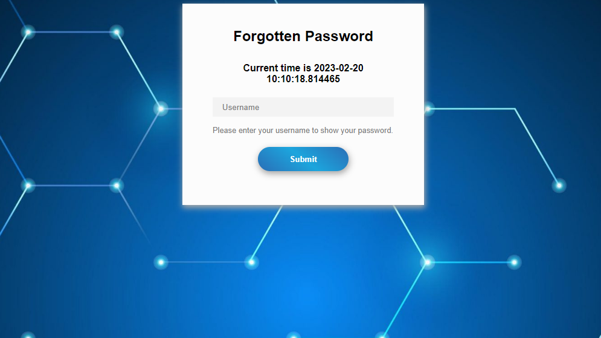
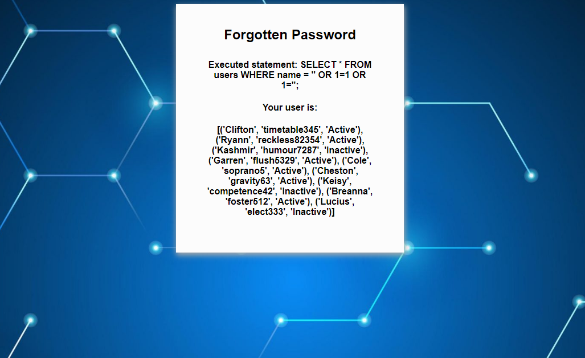

# vuln-webapp

### A basic webapp for teaching the dangers of SQL Injection.

## Setup:

- Clone this repository (`git clone git@github.com:ojoeth/vuln-webapp`)
- Initialise the python venv (`python3 -m venv .venv && source .venv/bin/activate`)
- Install Flask (`python3 -m pip install flask`)
- Initialise the Sqlite DB (`python3 dbinit.py`). Feel free to edit values of hardcoded fake usernames/passwords.
- Run the flask app (`flask --app main run`)

## Usage:
- Open the webapp in a browser 
- In the username entry box, enter a simple SQL injection. Example: `' OR 1=1 OR 1='`

## Screenshots:

